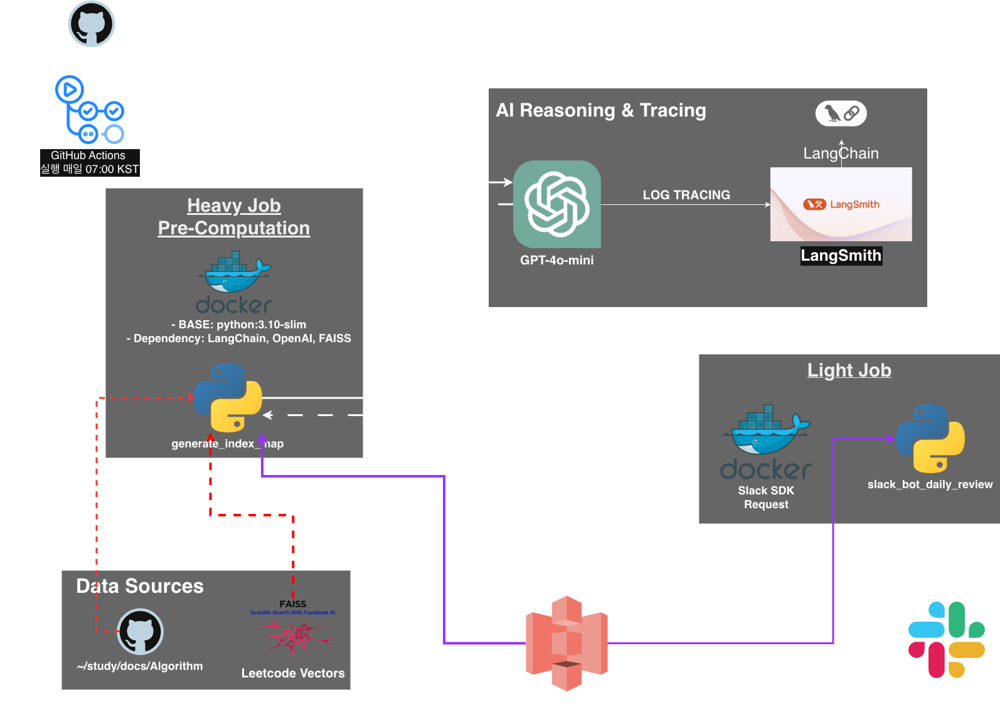
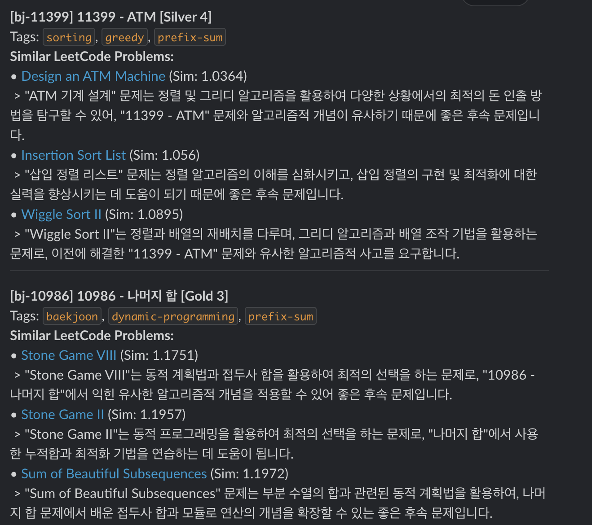

# Algorithm RAG Engine
백준 풀이 기록을 분석해 유사한 LeetCode 문제를 자동 추천하고, 매일 07:00 KST에 Slack으로 알림을 보냅니다.

## 아키텍처 개요
- Heavy Job (`src/main/generate_index_map.py`):
	- Baekjoon MDX → OpenAI 임베딩(text-embedding-3-small) → FAISS(LeetCode 인덱스) 유사도 검색 → GPT-4o-mini로 추천 이유 생성 → `artifacts/recommendation_map.json` 저장
- Light Job (`src/main/slack_bot_daily_review.py`):
	- JSON 로드 → Slack Webhook으로 메시지 전송
- GitHub Actions (`.github/workflows/daily_algorithm_pipeline.yml`):
	- 매일 07:00 KST 스케줄 실행 + 수동 실행 지원(workflow_dispatch)
- S3 사용(워크플로우에서만):
	- Job1: `aws s3 sync ./artifacts s3://hunbot-algo-rag-data/ --delete`
	- Job2: `aws s3 cp s3://hunbot-algo-rag-data/recommendation_map.json .`

## 프로젝트 개요
본 프로젝트는 개인 학습용 백준 알고리즘 풀이 기록(MDX)을 기반으로, OpenAI의 Embedding 모델과 FAISS 벡터 DB를 활용하여 가장 유사한 LeetCode 문제를 추천해주는 RAG(Retrieval-Augmented Generation) 시스템을 구축하는 것을 목표로 했습니다. 
단순한 추천에 그치지 않고 매일 자동으로 실행되어 슬랙으로 알림을 보내는 자동화된 파이프라인을 설계했습니다.

## 시스템 아키텍처 및 주요 기술 스택

* CI/CD 및 트리거: GitHub Actions를 사용하여 매일 정해진 시간에 파이프라인이 구동되도록 설정했습니다.
* 컨테이너화: 환경 격리와 의존성 관리를 위해 Docker를 사용했으며, 연산량이 많은 Heavy Job과 알림 전송용 Light Job으로 스테이지를 분리하여 효율성을 높였습니다.
* 데이터 적재 및 검색: LangChain 프레임워크를 기반으로 FAISS를 사용해 유사도 검색을 수행합니다.
* AI 모델: text-embedding-3-small 모델로 벡터화하고, gpt-4o-mini 모델을 통해 추천 사유를 생성합니다.

* 아티팩트 저장소: AWS S3를 중앙 저장소로 활용하여 대용량 인덱스 파일과 생성된 결과물(JSON)을 관리합니다.
* 모니터링: LangSmith를 연동하여 LLM의 추론 과정을 추적하고 품질을 관리합니다.

## 주요 기술적 과제와 해결 방안

* **Docker 이미지 빌드 시간 단축 및 최적화**: 초기에는 매 실행 시마다 PyTorch와 FAISS 같은 무거운 라이브러리를 설치하여 빌드 시간이 10분 이상 소요되는 문제가 있었습니다. 
이를 해결하기 위해 **GitHub Container Registry(GHCR)**를 도입하여 이미지를 사전에 빌드해두고, 실행 시에는 `docker pull`만 수행하도록 변경했습니다. 또한, GPU가 없는 CI 환경에 맞춰 **PyTorch를 CPU 전용 버전**으로 경량화하여 이미지 크기를 획기적으로 줄였습니다.

* **대용량 바이너리 파일 관리**: FAISS 인덱스 파일은 Git으로 관리하기에 부적절하여 **AWS S3**를 원본 저장소로 지정했습니다. 
GitHub Actions 실행 시점에만 S3에서 인덱스를 다운로드하고 Docker 볼륨으로 마운트하는 **하이브리드 스토리지 전략**을 통해 보안과 접근성을 모두 확보했습니다.

* **불필요한 중복 연산 제거**: 매번 모든 알고리즘 문제 파일을 다시 임베딩하는 비효율을 개선하기 위해, 
**GitPython**을 활용하여 가장 최근 커밋(`HEAD`)에서 변경된 파일만 감지하여 처리하는 로직을 구현했습니다. 이를 통해 API 호출 비용을 절감하고 처리 속도를 극대화했습니다.

## 최종 워크플로우 흐름

* **GitHub Actions 스케줄러**가 작동하여 워크플로우를 시작합니다.
* **GHCR**에서 사전에 빌드된 최적화된 Heavy Job 이미지를 다운로드(Pull)하고, **S3**에서 FAISS 인덱스를 가져옵니다.
* **Heavy Job 컨테이너**가 실행되며 Git 히스토리를 분석해 **최신 커밋된 알고리즘 문제 파일만 선별**합니다.
* 선별된 문제에 대해 임베딩 및 유사도 검색을 수행하고, 추천 결과(JSON)를 **S3**에 업로드(Sync)합니다.
* **Light Job 컨테이너**가 S3에서 JSON을 받아 Slack API를 통해 지정한 형식의 시각화된 메시지를 전송합니다.

### 최적화 성과

* **실행 시간 단축**: 사전 빌드 이미지 도입과 의존성 최적화를 통해 전체 파이프라인 실행 시간을 초기 약 12분에서 **4분 미만**으로 66% 이상 단축했습니다.
* **비용 절감**: 변경된 파일만 처리하는 로직을 통해 OpenAI API 호출 비용을 최소화했습니다.

### 향후 발전 방향

- 현재는 고정된 LeetCode 인덱스를 사용하고 있으나, 향후에는 새로운 문제가 추가될 때마다 인덱스를 자동으로 갱신하는 파이프라인을 추가할 계획입니다. 또한 슬랙 메시지에 인터랙티브 버튼을 도입하여 사용자 피드백을 수집하고, 이를 기반으로 추천 정확도를 높이는 루프를 구상 중입니다.
- Python 코드 내부의 병렬 처리 (Parallelism) 기법을 도입하여 대량의 알고리즘 문제를 동시에 처리하는 기능도 검토하고 있습니다. -> 공부한 뒤 적용할 계획입니다.
- 다른 사용자들이 사용할 수도 있어서(?) 최대한 범용적으로 바꿔보려고 합니다.

## 주요 파일
- `src/main/generate_index_map.py` — Baekjoon MDX → OpenAI 임베딩 → FAISS 검색 → GPT-4o-mini 이유 → JSON 저장
- `src/main/slack_bot_daily_review.py` — JSON 로드 → Slack Webhook 알림
- `Dockerfile` — heavy/light 멀티스테이지 빌드 (heavy: FAISS+LangChain, light: Slack 최소 의존성)
- `.github/workflows/daily_algorithm_pipeline.yml` — Job1(heavy) → S3 업로드 → Job2(light) → Slack
- `indexes/faiss_leetcode/` — 사전 구축된 LeetCode FAISS 인덱스 (필수)
- `artifacts/recommendation_map.json` — 생성된 추천 맵 (S3 업로드 대상)

---

아래 내용은 해당 알고리즘 앱을 범용적으로 만들게 되면, 바꿀 부분입니다. 지금은 개인으로 사용하기에 불편함이 없습니다..

### GitHub Repository Secrets 설정
Repository Settings → Secrets and variables → Actions → New repository secret에서 다음 키들을 추가:

| Secret 이름 | 설명 | 획득 방법 |
|------------|------|----------|
| `OPENAI_API_KEY` | OpenAI API 키 (임베딩 + GPT-4o-mini) | [OpenAI Platform](https://platform.openai.com/api-keys) |
| `SLACK_WEBHOOK_URL` | Slack Incoming Webhook URL | [Slack App 설정](https://api.slack.com/messaging/webhooks) |
| `AWS_ACCESS_KEY_ID` | AWS S3 접근용 액세스 키 ID | AWS IAM 사용자 생성 → Access Key 발급 |
| `AWS_SECRET_ACCESS_KEY` | AWS S3 시크릿 액세스 키 | 위와 동일 |
| `LANGSMITH_API_KEY` | LangSmith 추적용 API 키 (선택) | [LangSmith 설정](https://smith.langchain.com/) |

**Last Updated**: 2026-01-13
